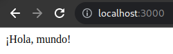

# Rails tutorials sample app
This is sample application comes from rails tutorials

## Chapter 1
- Initialize project
- Installing rails
- Adding rspec-rails and factory_bot (optional)

### 1.2.2 Exercise
1. According to the default Rails page, what is the version of Ruby on your system? Confirm by running ruby -v at the command line.

```bash
└─$ ruby -v
ruby 2.7.4p191 (2021-07-07 revision a21a3b7d23) [x86_64-linux-gnu]
```

2. What is the version of Rails? Confirm that it matches the version installed in Listing 1.2.

ok

### 1.2.3
- Introduction to MVC model
### 1.2.4 Hello, World!
- Adding hello action

```ruby
class ApplicationController < ActionController::Base
    def hello 
        render html: "hello, world!"
    end
end
```

- Adding routes

```ruby
get "application#hello"
```

#### Exercise:
1. Change the content of the hello action in Listing 1.9 to read “hola mundo!” instead of “hello, world!”.

```ruby
class ApplicationController < ActionController::Base
    def hello 
        render html: “hola mundo!”
    end
end
```

2. Show that Rails supports non-ASCII characters by including an inverted exclamation point, as in “¡Hola, mundo!” (Figure 1.18).14 To get a ¡ character on a Mac, you can use Option-1; otherwise, you can always copy-and-paste the character into your editor.



3. By following the example of the hello action in Listing 1.9, add a second action called goodbye that renders the text “goodbye, world! Edit the routes file from Listing 1.11 so that the root route goes to goodbye instead of to hello (Figure 1.19).

```ruby
def goodbye
    render html: "goodbye, world!"
end
```

### 1.3 Version control with git
- install and setup git
- create git project with git init
- add file to the commit
- commit
- check git status
- list commit with git log
- introduction to github
- create branch and push
- merge

### 1.4 Deploying (skip)

